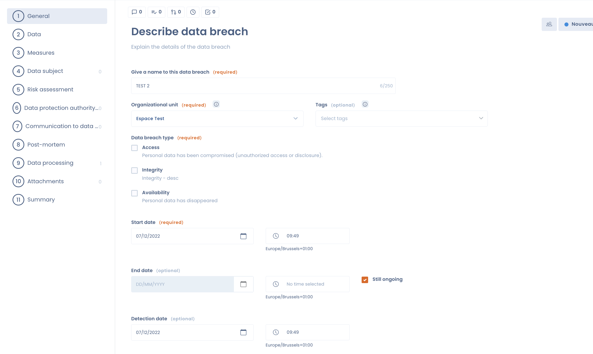
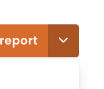
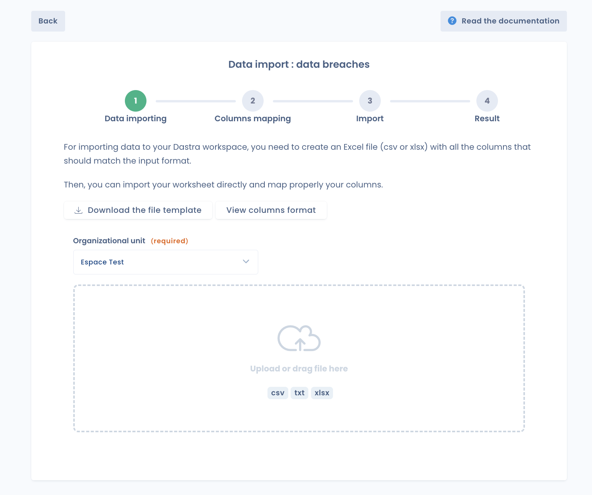
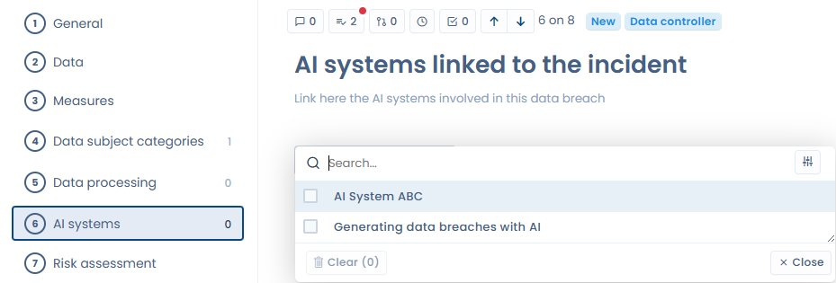

# Report a data breach

## Introduction

There are 2 possible ways to fill in a new data breach notification in DASTRA:

1. Fill in any new notification directly by hand
2. Import notifications by excel, csv or text file

### Manual creation of a data breach notification

By clicking on the "New incident report" button, a window appears where you can detail the data breach. Click on "Save and exit". That's it, you've created your first data breach notification manually!

<figure><figcaption>
Steps to document the violation
</figcaption></figure>

## Importing a notification into the data breach register

To import a data breach notification, click on the three vertical dots on the right of the screen.

<figure><figcaption></figcaption></figure>

A window appears with an "import" button. Click on it, download the registry template and follow the instructions to import the violations into Dastra. Once imported, the request will be directly available in the data breach register.

<figure><figcaption>
Data breach log import window
</figcaption></figure>

***

## Linking an AI system to a data breach

When a data breach involves an AI system — whether as the cause, the vector, or because it processes the affected data — you can associate it directly with the breach record.

From the breach editing page, in the **Additional information** section, use the **Linked AI systems** field to search for and associate one or more AI systems declared in your workspace.

<figure><figcaption>
"AI systems" tab in the breach record — search and select the systems involved
</figcaption></figure>

This association allows you to:

* Quickly identify the AI systems involved in incidents
* Link the breach to the AI Act compliance documentation of the relevant system
* Centralise incident tracking by AI system in your register

### "With an AI system" indicator in the incidents register

The data breach register now shows a **With an AI system** counter in the statistics bar at the top of the list. This metric lets you monitor at a glance the share of incidents involving an AI system in your organisation.
