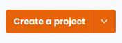
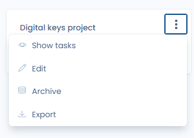
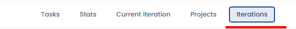
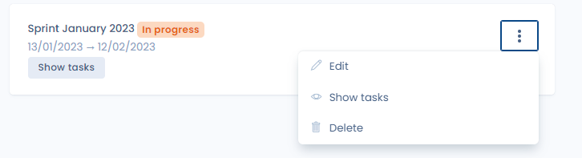

# Create or modify a project or an iteration

## Introduction

In Dastra,&#x20;

* a project refers to a list of tasks usually corresponding to a functional scope.&#x20;
* an iteration refers to a list of tasks usually corresponding to work to be done over a given period of time

## Create or edit a project

From the "Planning" module, click on the "Projects" tab

<figure><figcaption></figcaption></figure>

<figure><figcaption></figcaption></figure>

This will take you to the projects interface where you can create a new project by clicking on "create a project", or editing an existing one by clicking on the three dots to the right of the project, then "edit".

<figure><figcaption></figcaption></figure>

## Create or edit an iteration

From the "Planning" module, click on the "Iterations" tab

<figure><figcaption></figcaption></figure>

This will take you to the iterations interface where you can create new iterations by clicking on "create an iteration", or edit an existing one by clicking on the three dots to the right of the iteration, then "edit".

<figure><figcaption></figcaption></figure>

<figure><figcaption></figcaption></figure>

A second tab, "Current Iterations", allows you to see all tasks that are located in the current iteration.

<figure><figcaption></figcaption></figure>

## Go further


[exportez-vos-taches.md](exportez-vos-taches.md)

