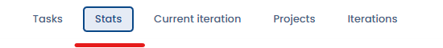
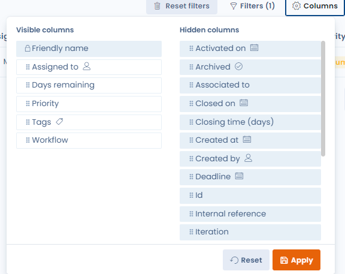
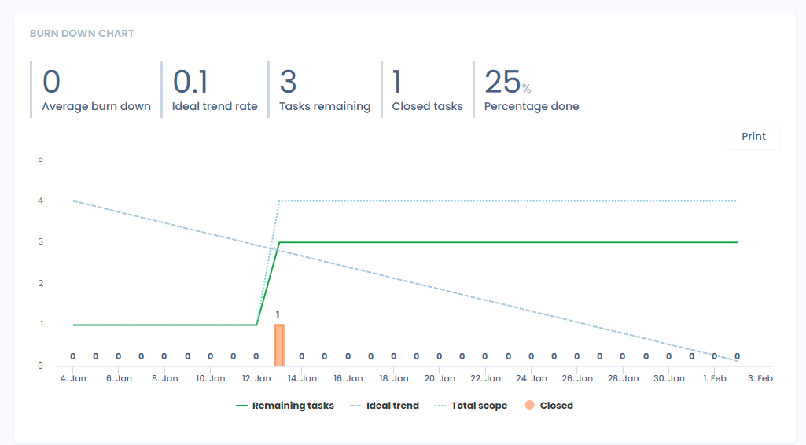
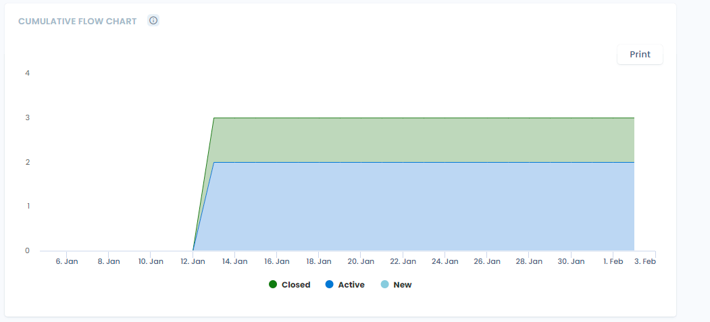
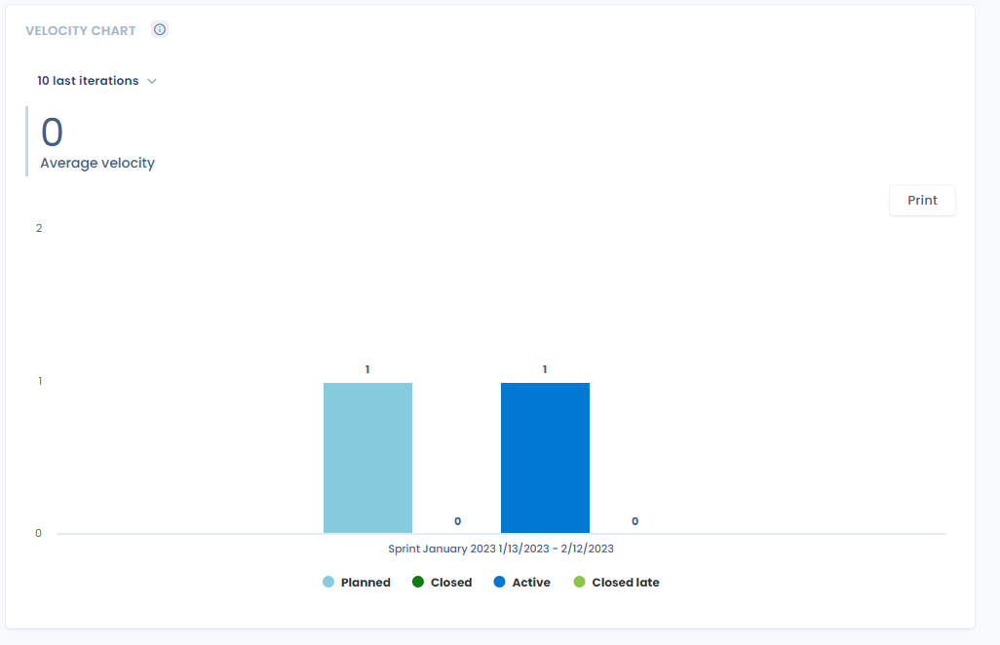
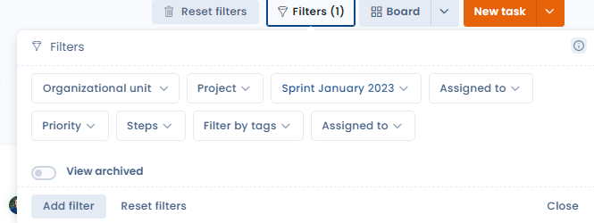
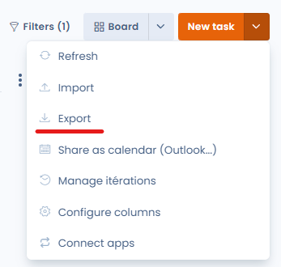
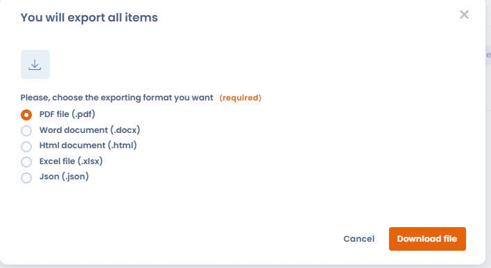
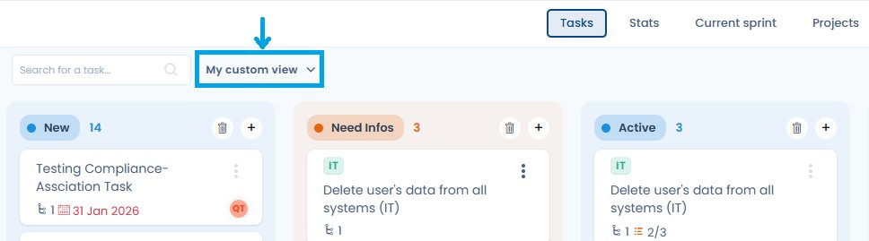

# Monitor, screen or export your tasks

## Introduction

<figure><figcaption></figcaption></figure>

This makes it possible to monitor your processes and produce statistics with the help of KPIs in an agile mode, to ultimately demonstrate your company's accountability with regard to the GDPR.&#x20;

## Task monitoring

#### Table tab

The columns tab displays a list of all tasks.&#x20;

The view can be customised using the dedicated configuration interface ("filters" and "columns" buttons).

<figure><figcaption></figcaption></figure>

#### Column tab&#x20;

The column tab provides access to a task overview that lets you view all tasks by status in a graphical way.

#### Progress chart

The progress chart summarises all the information about the progress made and the advancement of tasks over a given time frame.

This chart represents the evolution of the amount of work remaining for a given period (corresponding to an iteration).

<figure><figcaption></figcaption></figure>

#### Cumulative flow chart

This chart shows, over time, the distribution of tasks across the different life stages of a task.

<figure><figcaption></figcaption></figure>

#### Velocity chart

The velocity chart shows the evolution of the number of tasks closed per iteration.

<figure><figcaption></figcaption></figure>

You can filter tasks by priority, tags, departments, types, users or iterations directly from the filters available in each tab.

To export the tasks, go to the "column" or "table" tab of the "planning" module, then click the arrow on the right of the screen, then the "Export data" button.

<figure><figcaption></figcaption></figure>

A window appears with a choice of formats available for export. Click the format of your choice and then the "Download file" button.

<figure><figcaption></figcaption></figure>

A window appears with a choice of possible formats for export. Click on the format of your choice and then on the "Download file" button.

<figure><figcaption></figcaption></figure>

That's it, your tasks are exported!



## Custom views

The Planning module supports **custom views**: you can save a combination of filters and columns under a name, then switch between your views with a single click from the toolbar.

<figure><figcaption>
The view selector appears in the toolbar — switch between saved views with a single click
</figcaption></figure>

### Creating a view

1. Apply the desired filters and column selection in the **Table** or **Columns** tab.
2. Click **Save view** in the toolbar.
3. Give your view a name and confirm.

The view appears directly in the toolbar for quick access.

### Sharing a view

You can **share a view** with other users in your workspace. Shared views appear under the **Shared views** section in the toolbar — handy for standardising action plan monitoring across a team.

### Example use cases

* "Overdue tasks" view: filter on tasks past their due date with status ≠ Closed
* "My backlog" view: filter on the logged-in user, status = To do, sorted by decreasing priority
* "Q3 Sprint" view: filter on the current iteration, all columns displayed

## Go further


[share-as-calendar.md](share-as-calendar.md)

