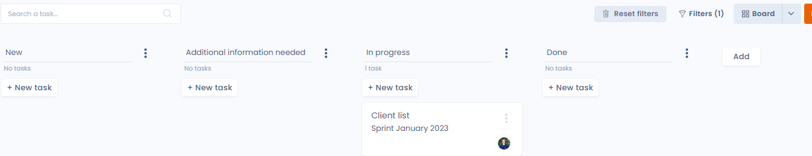

# Monitor, screen or export your tasks

In Dastra, all tasks in the action plan can be tracked from the "Statistics" tab in the planning module and exported.

<figure><figcaption></figcaption></figure>

This makes it possible to monitor your processes and produce statistics with the help of KPIs in an agile mode, to ultimately demonstrate your company's accountability with regard to the GDPR.

## Task monitoring

### Table tab

The columns tab displays a list of all tasks.

The view can be customised using the dedicated configuration interface ("filters" and "columns" buttons).

<figure><figcaption></figcaption></figure>

### Column tab

The column tab provides access to a task overview, which allows you to view all tasks by status in a graphical way.

<figure><figcaption></figcaption></figure>

### Progress chart

The progress graph summarises all the information concerning the progress made and the progress of the tasks over a given period of time.&#x20;

This graph represents the evolution of the quantity of work remaining for a given period (corresponding to an iteration).

<figure><figcaption></figcaption></figure>

### Cumulative flow chart

This graph shows the distribution of tasks over time in the different life stages of a task.

<figure><figcaption></figcaption></figure>

### Velocity chart

The velocity diagram shows the evolution of the number of closed tasks per iteration.

<figure><figcaption></figcaption></figure>

## Filtering tasks

It is possible to filter tasks by priority, tags, departments, types, users or iterations directly from the filters available in each tab.

<figure><figcaption></figcaption></figure>

## Exporting tasks

To export the tasks, go to the "column" or "table" tab of the "planning" module, then click on the arrow on the right of the screen, then on the "Export data" button.

<figure><figcaption></figcaption></figure>

A window appears with a choice of possible formats for export. Click on the format of your choice and then on the "Download file" button.

<figure><figcaption></figcaption></figure>

That's it, your tasks are exported!

## Custom views

The Planning module supports **custom views**: you can save a combination of filters and columns under a name, then switch between your views with a single click from the toolbar.

<figure><figcaption>
The view selector appears in the toolbar — switch between saved views with a single click
</figcaption></figure>

### Creating a view

1. Apply the desired filters and column selection in the **Table** or **Columns** tab.
2. Click **Save view** in the toolbar.
3. Give your view a name and confirm.

The view appears directly in the toolbar for quick access.

### Sharing a view

You can **share a view** with other users in your workspace. Shared views appear under the **Shared views** section in the toolbar — handy for standardising action plan monitoring across a team.

### Example use cases

* "Overdue tasks" view: filter on tasks past their due date with status ≠ Closed
* "My backlog" view: filter on logged-in user, status = To do, sorted by decreasing priority
* "Q3 Sprint" view: filter on the current iteration, all columns displayed

## Go further


[share-as-calendar.md](share-as-calendar.md)

