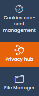
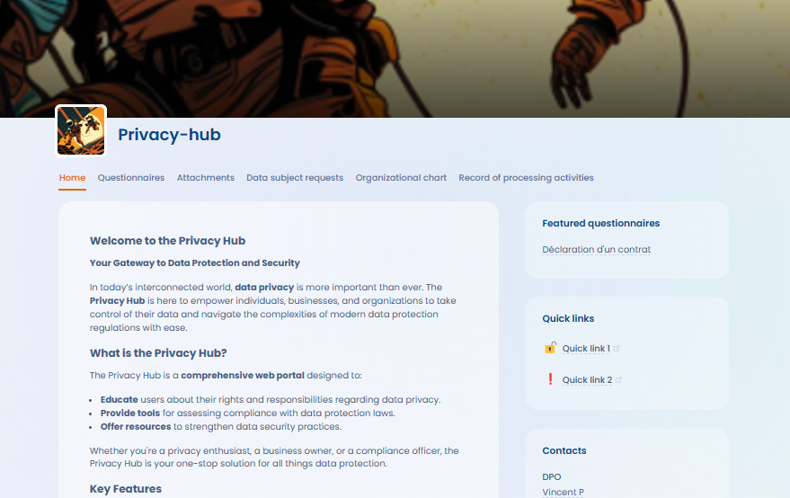

# Trust center

The **Trust center** allows organizations to create and customize a fully configurable **public web portal** designed for managing compliance with personal data protection regulations. The Trust center provides a simple and intuitive solution to establish a space for transparency and interaction with the organization's stakeholders, whether customers, subcontractors, or employees.

The Trust center offers modular and flexible configuration, enabling you to select and activate the features of your choice from the following options:

* [Customizable Home Page](configuration/home.md) (mandatory)
* [Questionnaires](configuration/questionnaires.md) (optional - requires the [Questionnaires](../audit/) feature)
* [Attachments](configuration/attachments.md) (optional)
* [Data subject requests](configuration/data-subject-requests.md) (optional - requires the [Data subject requests](../gerer-les-exercices-des-droits/) feature)
* [Organizational Chart](configuration/org-chart.md) (optional)
* [Record of processing activities](configuration/record-of-processing-activities.md) (optional - requires the [Record of processing activities](../editer-le-registre/) feature)
* [AI Systems](configuration/ai-systems.md) (optional - requires the AI Systems module in your subscription)

### How to access the feature&#x20;

To access the feature, your subscription must include our [Trust centers](./ "mention") feature.

You can access the Trust centers from the application's side navigation bar.

<figure><figcaption>
Access the Trust centers from Dastra's sidebar
</figcaption></figure>

<figure><figcaption>
Preview of a Trust center with all features enabled
</figcaption></figure>
