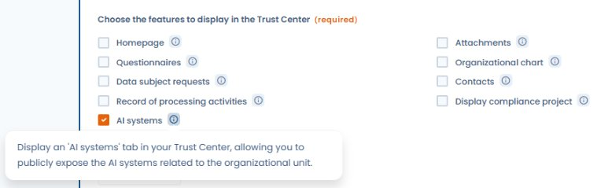

# AI Systems

Dastra's Trust center lets you publicly expose (or restrict access to) the AI systems declared in your workspace. This feature supports the transparency obligations of the AI Act and builds trust with your customers, partners, and data subjects.

***

## Enabling the AI Systems tab

In your Trust center configuration, activate the **AI Systems** module under **Trust center > Configuration > AI Systems**.

<figure><figcaption>
Check "AI systems" in the features to display to activate the tab on the public portal
</figcaption></figure>


The AI Systems tab is only available to organizations whose subscription includes the AI Systems module. If you do not see this option in your Trust center configuration, contact the Dastra team to enable the module.


Once enabled, a dedicated tab appears on the public portal, listing the AI systems you have chosen to make visible.

<figure><figcaption>
Public view of the Trust center with the "AI systems" tab listing exposed systems
</figcaption></figure>

***

## Choosing which systems to publish

By default, no AI systems are published. For each system declared in Dastra's AI Systems module, you can choose to make it:

* **Visible** — it appears in the Trust center tab
* **Hidden** — it remains internal, not shown on the portal

This granularity lets you publish only the systems relevant to your stakeholders (e.g. systems deployed in direct interaction with customers or data subjects) while keeping internal systems out of public view.

***

## Information displayed

For each published AI system, the Trust center can display:

* The **name** and **description** of the system
* Its **purpose** and **categories of data subjects**
* The **AI Act risk level** (minimal, limited, high risk, prohibited)
* The **responsible contact** or AI point of contact
* The **transparency measures** in place

The fields displayed depend on the information recorded in the AI system record and your Trust center configuration choices.

***

## Link to AI Act obligations

Displaying AI systems in the Trust center helps fulfil the transparency obligations of the AI Act (Art. 13 and 50) for deployers of limited-risk and high-risk systems. It does not replace individual information notices required in certain cases, but provides a centralised reference point for your stakeholders.


For systems classified as **high risk**, specific documentation obligations apply (Art. 13 AI Act). Publication in the Trust center complements — but does not replace — the technical documentation required by the regulation.

