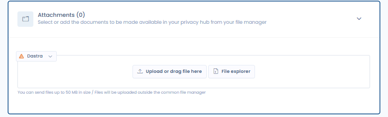

# Attachments

#### Activating the 'Attachments' Feature in your Trust center

To activate the 'Attachments' feature in your Trust center, refer to the general configuration section where you can enable or disable this option. Once activated, a new public page titled **'Attachments'** will be added to your Trust center.

<figure><figcaption>
The attachments configuration accordion
</figcaption></figure>

#### Adding attachments to your Trust center

Add files in this tab (either by uploading them or selecting them from your existing documents in document management) to make them publicly available in the **Attachments** tab of your Trust center (for viewing and downloading).
