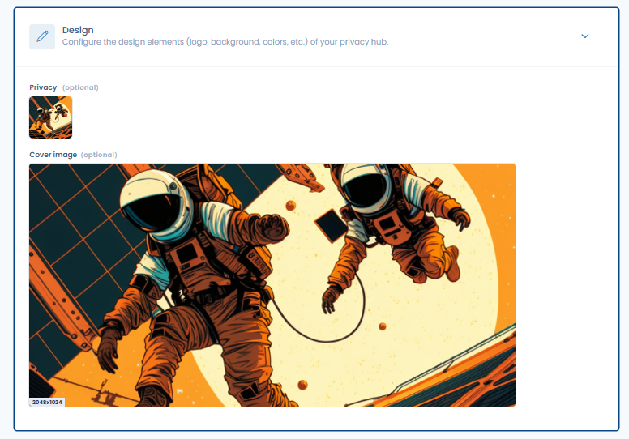

# Appearance and design

<figure><figcaption></figcaption></figure>

#### Logo (Optional)

You can add your chosen logo (square format) to your Trust center. This logo will appear in the header of your Trust center, next to its name. In the absence of a logo, only the name of your Trust center will be displayed.

#### Cover Image (Optional)

You can add a cover image of your choice (rectangular format) to your Trust center. If provided, this image will appear in the header of your Trust center, above the logo and the title.
