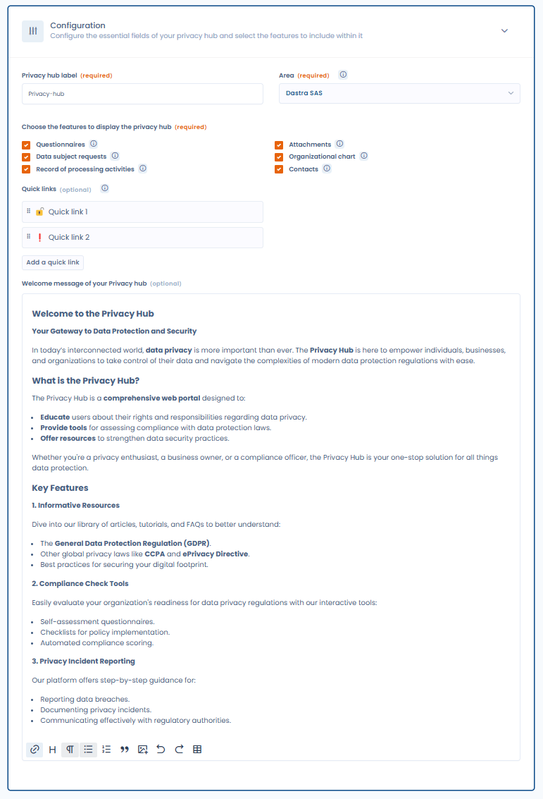

# Homepage and general configuration

#### The 'Configuration' Tab of a Trust center Editing Page

The **'Configuration'** tab on a Trust center's editing page allows you to set up the essential options for your Trust center.

<figure><figcaption></figcaption></figure>

**Trust center label**

The name of the Trust center will appear in the header and on every page of your portal.

#### Organizational Unit

It is essential to link your Trust center to an organizational unit. This selection directly impacts all the features activated in the hub. For more details on how this choice affects functionality, refer to the configuration page for each feature.

#### **Trust center welcome message**

This rich text (HTML) field allows you to customize the welcome message with formatting options and to include images or videos. This message will be displayed on the public homepage of your Trust center.

#### **Trust center features**

In this section, select the features to activate in your Trust center (depending on the options included in your subscription). Checking a feature box enables it in your hub. If specific configuration is required, checking the box will unlock a settings accordion, allowing you to configure the feature directly from the Trust center editing page. Refer to the documentation pages below for detailed configuration instructions for each feature.

#### **Quick links**

You can add redirect links to your Trust center by clicking the "Add Link" button. Each link consists of an optional emoji, a name, and a destination URL. This feature allows you to create shortcuts to external resources. The links will appear in a side menu on the homepage of your Trust center and will open in a new window when clicked by your users.
