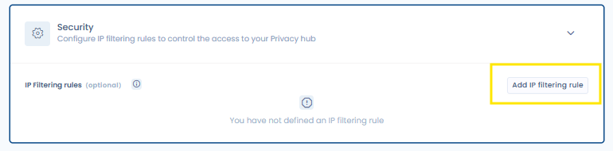

# Security

The Security tab brings together three types of configuration: Privacy Hub owner management, document access control, and IP address filtering.

## Privacy Hub owners

You can designate **one or more owners** for your Privacy Hub. Owners receive document access requests and can approve or decline them from a dedicated screen in the Privacy Hub module.

<figure><figcaption>
Configuring owners and access control in the Security tab
</figcaption></figure>

## Document access control

By default, an **access confirmation** is required before visitors can download documents published in the Privacy Hub. This behaviour can be configured in the Security section.

When document access control is enabled:

1. Visitors can see the list of available documents, but must submit an **access request** by providing their email address and the reason for their request.
2. Privacy Hub owners receive an email and can **manage access requests** from the administration interface.
3. If the request is approved, the visitor receives an email containing a **download link valid for 30 days**.


If no owner is designated, access requests cannot be processed. Make sure at least one active owner is always assigned.


## IP address filtering

This section also allows you to define rules that limit access to your Privacy Hub to specific IP ranges. By default, without any IP filtering added by you, your Privacy hub will be accessible to anyone with the access link, provided that the Privacy hub is activated.
