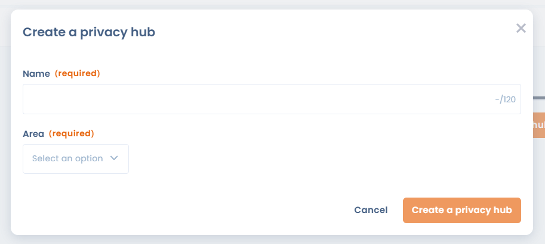
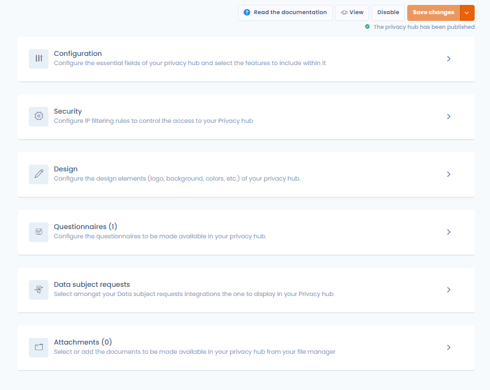

# Create a Trust center

You can create a Trust center from the homepage of the Privacy-hub feature by clicking on "Create a Trust center." This option may potentially be locked if you have already reached the quota of Trust centers allowed by your plan.

<figure><figcaption>
Create a trust center
</figcaption></figure>

You must provide a name and an organizational unit to complete the creation of your Trust center.

<figure><figcaption></figcaption></figure>

Once the hub is created, you will be redirected to the editing page of your Trust center.

<figure><figcaption>
Trust center configuration page
</figcaption></figure>
