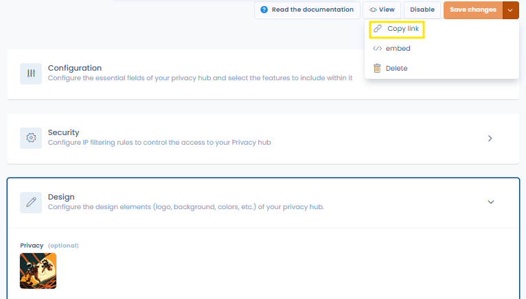
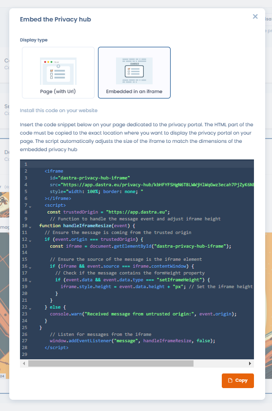

# Preview and share your trust center

#### Preview Your Trust center

You can preview your Trust center at any time by clicking the **View** button located at the top right of the configuration page (provided your Trust center is activated).\
If you make changes on the configuration page, you will need to refresh the preview page (or reopen it) to view your updates.

#### Share Your Trust center

Once the configuration is complete, you can share the URL of your Trust center.\
To do this, you can either directly copy the URL from the preview window or click on the **Copy Link** option from the Trust center menu.

<figure><figcaption></figcaption></figure>

#### Embed your Trust center in an iframe

You can also embed your Trust center in an iframe. To do so, you can retrieve the iframe code by clicking the **Embed** option from the menu of your Trust center.

<figure><figcaption></figcaption></figure>

