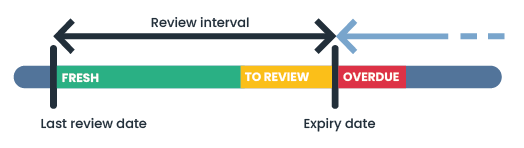

# Regular review (freshness)

## **What is the freshness indicator?**&#x20;

Freshness is an indicator of when an item was last reviewed in Dastra. It can be a treatment, an object in your repository or even a contract. By activating this feature you'll define a future review date for the item, and the freshness will degrade as this date approaches. This feature is a simple and fun way of ensuring that you regularly review the information entered in the application.

<figure><figcaption>
Freshness indicator operating diagram
</figcaption></figure>

## How do I activate the freshness indicator?&#x20;

To activate the freshness of an object type, go to your workspace settings and select the Regular reviews tab.

<figure><figcaption>
The configuration menu for the reg
</figcaption></figure>

From this menu, you can activate freshness for the various objects that have this feature by clicking on the object selection drop-down menu.

<figure><figcaption>
The list of objects for which you can activate freshness
</figcaption></figure>

Tick the option to activate regular review of the item and set the **desired time interval between each review**.&#x20;

The freshness of an item corresponds to the number of days between the last date on which the item was marked as fresh and its future review date.&#x20;

The review date is a date in the future calculated from the last date on which the item was marked as fresh, to which we add the desired **time interval between each review.**&#x20;

Please note that this expiry interval will be the same for all items of the same type for which the review is active.

## Deactive the freshness option

To deactivate the option, simply uncheck the Enable regular item review box in the Regular reviews section of your workspace settings.

## Displaying the freshness indicator

All objects with this functionality have a freshness column that you can add to the summary tables. This column is called "**Last review date**", and allows you to monitor the freshness status of each item.&#x20;

Please note that freshness is only displayed for **published items**.

<figure><figcaption>
The freshness column
</figcaption></figure>

You will also find this indicator in the item shortcut menu.

<figure><figcaption>
the freshness indicator in an item's shortcut menu
</figcaption></figure>

## Rules for displaying review statuses

There are 3 possible freshness statuses: fresh, pending or out of date. By default, the following display rules apply:

<table><thead><tr><th width="258">Review status</th><th>Display rule</th></tr></thead><tbody><tr><td>Fresh (green colour)</td><td>
The item has been reviewed recently and does not require immediate attention. 

This status is displayed until the current date is within the last 10 percent of the expected interval since the last review.
</td></tr><tr><td>Pending (orange)</td><td>
The item needs to be checked. 

This status is displayed for the last ten percent of the planned interval since the last review.
</td></tr><tr><td>Out of date (red)</td><td>
The item no longer complies with the review policy. 

This status is displayed when the current date is greater than the last review date + the defined interval.
</td></tr></tbody></table>


Example: I have defined 1 year interval for reviewing data processing activities. For a processing reviewed on 1 January:&#x20;

* it will be displayed fresh until 25 November
* it will be displayed pending 25 November
* On 31 December, it will then be displayed as out of date until it is reviewed.


## Review an item

You can decide to review an item at any time, without necessarily waiting for the next review date. To do this, click on the cell in the fresh column of an item when you are in a table view. Of course, the functionality must be active for this element and you must be displaying the column in question.

This takes you to the item review window. Note that it is possible to consult old reviews from this window.

<figure><figcaption>
The item review window
</figcaption></figure>

By reviewing an item, you restart a freshness cycle from the current date until the next review date. The review date is calculated by default according to the item's review interval setting (see above). You can decide to ignore this default date and apply a specific expiry date to this item by ticking the "Change next review date" option and selecting a new date (the next review date must be at least D+1).

## Notifications

The creator of the element, as well as the users associated with the element (owners in the case of treatments, for example), will be notified by email when an element reaches the out-of-date state, to remind them that the element has not been revised for a long time and that it is time to refresh it.
