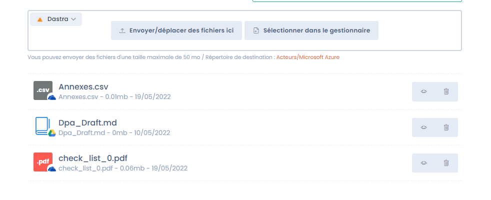

# OneDrive / Google Drive integrations

## Why use custom cloud storage?

By default, Dastra's [document management system](../gestion-de-documents-ged/) relies on Azure Blob Storage: files are encrypted, scanned for viruses, and redundantly stored on a secondary server. For more details, see the [security documentation](../../security/general.md).

In some organizations, this storage duplicates an existing cloud file system (SharePoint/OneDrive, Google Drive). Dastra integrates natively with both providers to avoid this duplication.

<figure><figcaption>
Files can be stored in Dastra, OneDrive, or Google Drive
</figcaption></figure>

## Connection type: user OAuth


This integration uses **OAuth authentication with a user account's credentials**. It is not an application-level connection via the Microsoft Graph API or the Google API.

In practice, this means:

* The connection is established **on behalf of the user** who configures the integration
* Access to files depends on **that account's permissions**
* If the account is deactivated or its tokens revoked, the integration stops working until it is reconnected
* It is recommended to use a **dedicated service account** (non-personal) to configure this integration


## Setting up the integration

Go to **Workspace Settings > Integrations**, then click on **OneDrive** or **Google Drive**.

<figure><figcaption>
Click "Add integration" to start the connection
</figcaption></figure>

Click **Add integration**. You will be redirected to the provider's login page, where you will be asked to authorize access to your storage.

### Choosing the root drive (OneDrive only)

After authentication, Dastra asks you to choose which drive to use as the root:

<figure><figcaption>
Choose between the SharePoint site or your personal drive
</figcaption></figure>

| Option | Description | Recommendation |
|---|---|---|
| **Root site / Dastra** | Organization's SharePoint site | ✅ Recommended for enterprise use — shared space, not tied to a personal account |
| **Your personal drive** | Personal OneDrive of the connected account | ⚠️ Avoid in production — grants access to all personal drive files |


If you use a personal drive, it is strongly recommended to use a dedicated service account that does not contain personal files. You can also create a [dedicated SharePoint site](https://learn.microsoft.com/en-us/sharepoint/create-site-collection) to isolate Dastra files.


Dastra automatically creates an **Applications\DastraOneDrive** directory on the chosen drive, which it uses as the root for all files.

## Attaching cloud files to a Dastra entity

From any entity (processing activity, task, actor…), you can attach files stored in your cloud:

1. Open the file panel of the entity
2. Select the **data source** at the top left of the panel

3. Browse your drive via the file manager
4. Click **Select from manager** to attach the file

You can also upload new files directly from Dastra to your Drive.

## Limitations

### OneDrive

* The connection uses user OAuth — not the Microsoft Graph API. If the account that set up the integration is deactivated, the connection is interrupted.
* Dastra only has access to the **Applications\DastraOneDrive** directory on the chosen drive.
* For enterprise environments, prefer the SharePoint site ("Root site / Dastra") over a personal drive.

### Google Drive

* Only files **created from within Dastra** can be added or modified in Google Drive. Dastra does not have access rights to files created directly in Drive — this is a limitation of the OAuth connector.
* Files created in Dastra can be shared with other collaborators without restriction.
