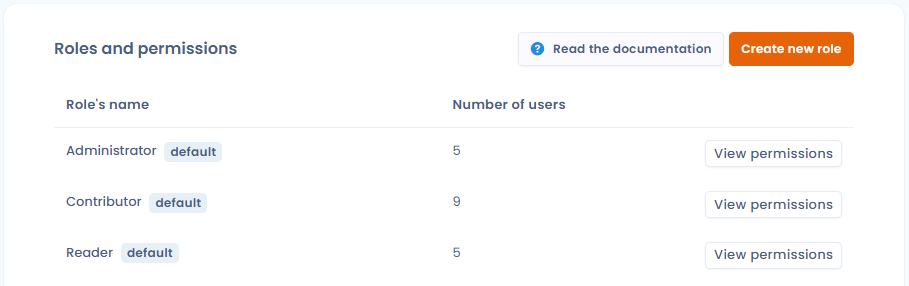
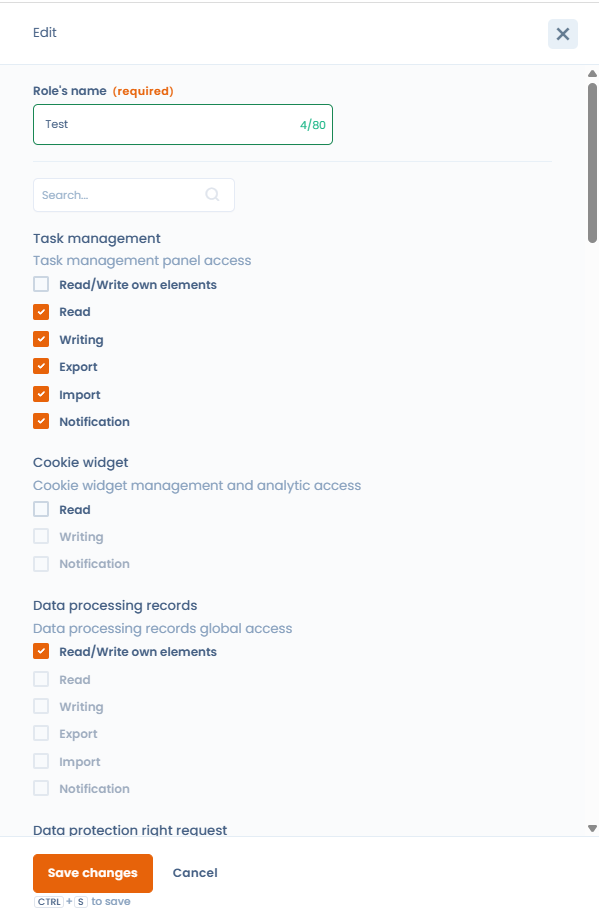

# Roles and permissions

## General Functioning

Each user can be associated with 1 or more roles. The roles are themselves associated with a list of permissions (e.g.: write in the registry, post a request to exercise a right...). There are two ways to manage the roles associated with users.&#x20;

* If you are an owner, you can use [this account management interface](https://app.dastra.eu/general-settings/users?q=\&page=1\&size=20)
* If you have the role of entity administrator, you can manage the roles and permissions of users belonging to your entity using [this interface](https://app.dastra.eu/general-settings/roles).

## Create your own roles

To create your own roles associated with permissions, go to [this page](https://app.dastra.eu/general-settings/roles).&#x20;

You can create a custom "new role" by clicking on the "Create a new role" button\
 

<figure><figcaption></figcaption></figure>

It is possible to select the boxes associated with permissions

<figure><figcaption>
Creating a role
</figcaption></figure>

\
**Read/Write own elements:** Users can only view and edit items assigned to them within the module.

**Read:** Users can view all items in the module.

**Writing:** Allows modification of all items in the module.

**Export:** Permits exporting all items.

**Import:** Allows importing all items into the module.

**Notification:** Users receive notifications for all items in the module.


It is not possible to select both “Read/Write own elements” and permissions on all items for the same role in a module. Users can access either only their own items or all items.


\
Once you've created your custom role, you can assign it to any workspace user within your organization.

## Clone an existing role

To save time when creating a new role based on an existing configuration, you can **clone a role** in a single click. Open the role you want to duplicate, then click **"Clone"**. A new role is created immediately with all the same permissions as the source role — simply rename it and adjust any permissions as needed.

This is particularly useful for creating variants of an existing role (e.g. a "DPO Contributor" role that is slightly different from a regular "Contributor") without starting from a blank canvas.
