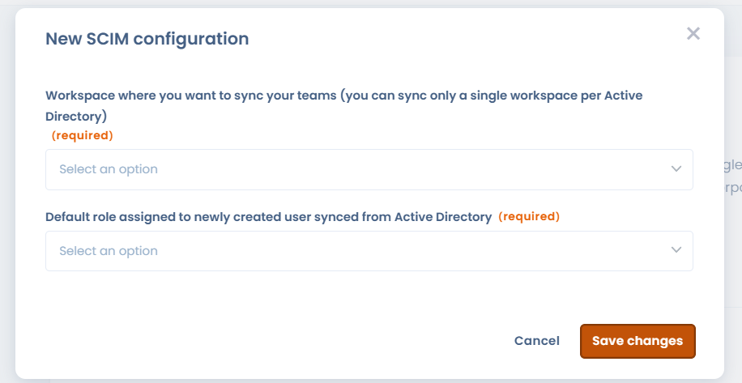

# SCIM

### How it works

SCIM (System for Cross-domain Identity Management) is an open standard for automating user provisioning. The SCIM protocol acts as an intermediary, collecting user identity data from identity providers (Microsoft Entra ID, Google Workspace, Okta...) and communicating it to service providers (such as Dastra) who need the credentials.


The SCIM feature is reserved for customers on an **Enterprise plan.**

[See our pricing page](https://www.dastra.eu/en/pricing)



We strongly recommend that you first [set up SSO](single-sign-on-sso/) with the **"Force for all users" option enabled**.


### How do I configure SCIM with Microsoft Entra ID?

Dastra users can be added, deleted and modified using SCIM 2.0. You define groups in Entra ID and Dastra synchronizes those users automatically — no manual intervention required.

#### 1. Sign in to the Microsoft Entra portal

Go to [https://entra.microsoft.com](https://entra.microsoft.com) and sign in with an administrator account.

#### 2. Navigate to "Enterprise applications"

In the left-hand menu, click **Entra ID** > **Enterprise applications** > **All applications**.

#### 3. Click "New application"

At the top of the application list, click **New application**.

<figure><figcaption></figcaption></figure>

#### 4. Create your own application

On the "Browse Microsoft Entra App Gallery" page, click **+ Create your own application**.

#### 5. Name and configure your application

In the panel that opens:

1. Enter a name for your application (e.g. **Dastra SCIM**)
2. Select **"Integrate any other application you don't find in the gallery (Non-gallery)"**
3. Click **Create**

#### 6. Open the provisioning configuration

On the **Overview** page of the newly created application, click **"3. Provision User Accounts"** or click **Provisioning** in the left navigation menu.

#### 7. Retrieve the SCIM URL and token from Dastra

Before configuring Entra, get your SCIM credentials from Dastra.

**Log in to Dastra** as an owner. Go to **Organisation Settings** >[ **Single Sign On**](https://app.dastra.eu/general-settings/sso) > **SCIM**

<figure><figcaption></figcaption></figure>

Click the **Configure** button to create a new SCIM configuration.

<figure><figcaption>
Select the target workspace and the default role for new users
</figcaption></figure>

Select the **workspace** to synchronize (teams and users will be automatically provisioned there) and the **default role** assigned to new users. Roles can still be modified locally by Dastra administrators.

Click **Save**, then **copy the SCIM URL and authentication token** displayed.


Dastra supports synchronizing **one workspace per organization** via SCIM.


#### 8. Configure automatic provisioning in Entra

Back in Entra, on your application's provisioning page:

1. Set **Provisioning Mode** to **Automatic**
2. Under **Admin Credentials**, fill in:
   * **Tenant URL**: the SCIM URL copied from Dastra
   * **Secret Token**: the authentication token copied from Dastra

<figure><figcaption></figcaption></figure>

3. Click **Test Connection** to verify the connection
4. Click **Save**

If you encounter an error during the connection test, check that the SCIM feature is enabled on your subscription. [Contact support if needed](../../getting-started/support/make-a-support-request.md)

#### 9. Activate provisioning

Once the configuration is saved, activate provisioning by setting the status to **On** and clicking **Save**.

<figure><figcaption></figcaption></figure>

#### 10. Add users and/or groups

In the application navigation menu, click **Users and groups**, then assign the Entra users or groups you want to synchronize with Dastra.

### Let your users log in

You should see your Entra directory accounts automatically synchronized in Dastra. If SSO is not configured and enforced, users will need to reset their password for their first login. If SSO is enabled and forced for all users, they will be automatically redirected to your identity provider's login form (Microsoft Entra ID, Google Workspace, Okta…).

### SCIM Synchronization Behavior and Limitations

#### User Lifecycle Management

**User Disabled in Entra ID**

When a user is disabled in Entra ID:

* Their profile is **anonymized in Dastra**
* If the user is later re-enabled:
  * A **new user account is created**
  * The previous anonymized account is not restored

***

**Full Deletion in Entra ID**

When a user is permanently deleted from Entra ID:

* Their profile is **fully anonymized in Dastra**
* All past actions are **preserved**
* The user appears as **"deleted user"**

**Impact on related data:**

* Linked objects (e.g. processing activities, risks, requests, etc.) are **not deleted**
* Relationships (e.g. owner, assignee) are **preserved**
* Only the user’s identity is anonymized

***

#### Group (Team) Management

**Group Removal in Entra ID**

If a group is removed in Entra ID:

* The corresponding **team is deleted in Dastra**
* **User accounts remain active**
* No impact on individual users

***

#### Mapping and Synchronization Scope

**Groups and Workspaces**

* SCIM supports synchronization of **multiple groups**
* Current limitation:
  * Only **one workspace per organization** can be synchronized
  * Multi-workspace synchronization is **not supported**

***

**Supported Attributes**

Currently, Dastra synchronizes:

* Group **name (`displayName`)**

Not supported at this stage:

* Mapping to **organizational units**
* Synchronization of attributes such as:
  * organization
  * country

> This could be supported in the future via a specific attribute containing a reference identifier compatible with Dastra.

***

#### Local Management in Dastra

After SCIM synchronization:

* Administrators can still:
  * **modify roles**
  * **adjust permissions**
* Fine-grained access control remains **manageable locally in Dastra**

***

#### Licensing Impact

* SCIM synchronization is limited by:
  * the **number of users included in your subscription**
* If the quota is exceeded:
  * The SCIM server returns an **error**
  * Additional users are **not provisioned**

***

## Frequently Asked Questions

### What is the role of SCIM in Dastra?

SCIM is the **automated provisioning channel** between your enterprise directory (Entra ID, Okta, Google Workspace…) and Dastra. Its role is complementary — and distinct — from SSO:

|                  | SSO                     | SCIM                                    |
| ---------------- | ----------------------- | --------------------------------------- |
| **Role**         | Authentication (login)  | User lifecycle management               |
| **Trigger**      | User login              | Action in the IdP (add, update, remove) |
| **What it does** | Verifies identity       | Creates, updates, deactivates accounts  |
| **Protocol**     | SAML 2 / OpenID Connect | SCIM 2.0 (HTTP REST + JSON)             |

With SCIM, you no longer need to manually create accounts in Dastra or revoke them when someone leaves — your directory remains the **single source of truth** for identity management.


SCIM manages **who exists** in Dastra. SSO manages **how those people log in**. The two are independent but combine ideally: provision via SCIM, authenticate via SSO.


***

### What is the expected overall process for provisioning and deprovisioning?

#### Provisioning (account creation)

When a user or group is assigned to the Dastra application in your IdP:

1. The IdP sends a **`POST /scim/v2/Users`** request to the Dastra SCIM endpoint
2. Dastra creates the account with the default role set in your SCIM configuration
3. The user is added to the target workspace
4. If SSO is enabled and enforced, the user can log in immediately without a password

#### Updates

Any profile change in the IdP (name, email, group membership) triggers a **`PATCH /scim/v2/Users/{id}`** request that updates the corresponding account in Dastra.

#### Deprovisioning (deactivation / deletion)

| Action in the IdP  | SCIM request                  | Effect in Dastra                             |
| ------------------ | ----------------------------- | -------------------------------------------- |
| User disabled      | `PATCH` (`active: false`)     | Profile **anonymized**                       |
| Permanent deletion | `DELETE /scim/v2/Users/{id}`  | Profile **fully anonymized**, data preserved |
| Group removed      | `DELETE /scim/v2/Groups/{id}` | Team deleted, users unaffected               |


Re-enabling a previously anonymized user creates a **new account** — the history of the old account is not restored.


***

### Which attributes and claims are supported?

#### SCIM attributes synchronized (provisioning)

During synchronization, Dastra reads the following SCIM 2.0 attributes:

| SCIM attribute     | Field in Dastra           | Required                  |
| ------------------ | ------------------------- | ------------------------- |
| `userName`         | Email (unique identifier) | ✅ Yes                     |
| `name.givenName`   | First name                | Recommended               |
| `name.familyName`  | Last name                 | Recommended               |
| `displayName`      | Display name              | Recommended               |
| `emails[0].value`  | Email address             | ✅ Yes                     |
| `active`           | Active / inactive status  | ✅ Yes                     |
| `externalId`       | IdP identifier            | Recommended               |
| `groups[].display` | Team name                 | For group synchronization |

#### SSO claims used at login

When logging in, Dastra identifies the user via the email claim sent by the IdP. Both supported SSO protocols use the same property:

| Protocol       | Email claim used                                                     | Required scope         |
| -------------- | -------------------------------------------------------------------- | ---------------------- |
| SAML 2         | `http://schemas.xmlsoap.org/ws/2005/05/identity/claims/emailaddress` | —                      |
| OpenID Connect | `http://schemas.xmlsoap.org/ws/2005/05/identity/claims/emailaddress` | `openid profile email` |


The email address is the **linking key** between SCIM and SSO: the `userName` provisioned via SCIM must be **identical** to the email claim returned at SSO login. Any discrepancy will prevent account matching.


For the full SSO claim configuration, see the [Single Sign On (SSO)](single-sign-on-sso/) page.
