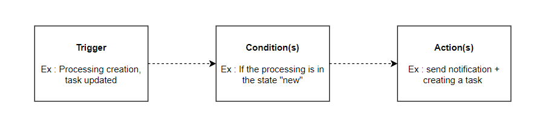
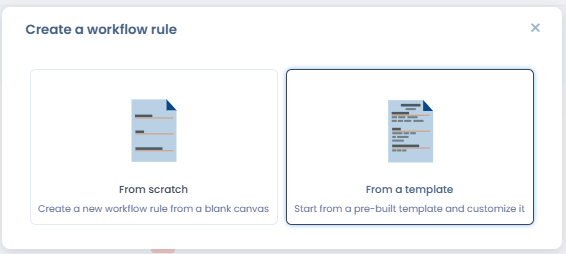
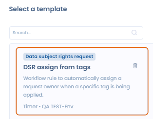
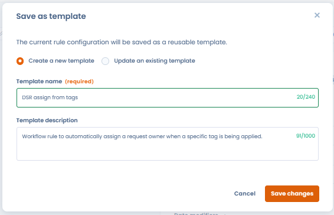
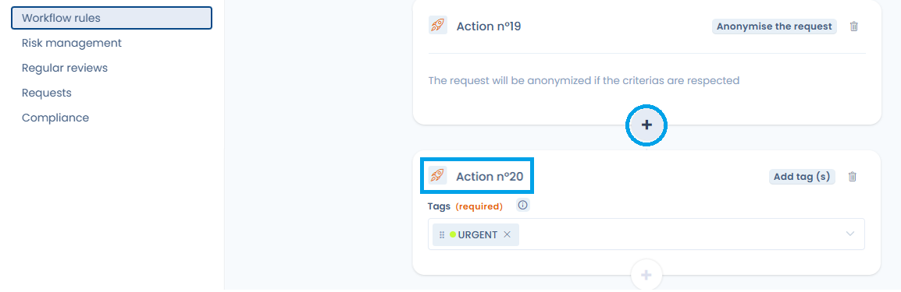
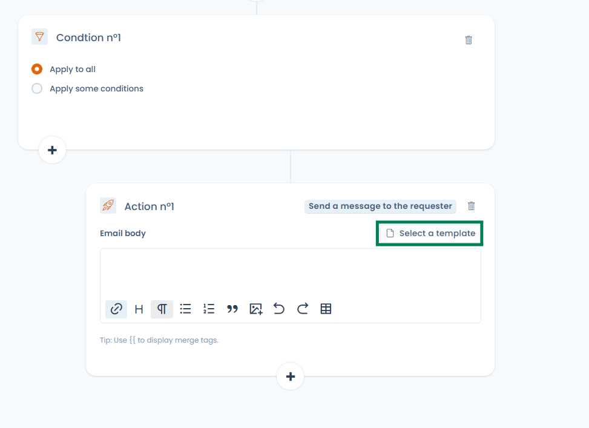
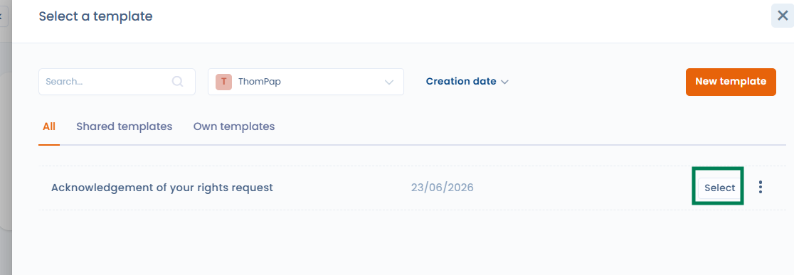
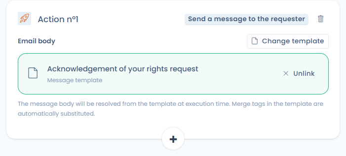

# Workflow rules


**Workflow stages vs workflow rules**

[Workflow stages](workflow-stages.md) define the steps an object moves through (e.g. New → In Progress → Done). **Workflow rules** automate actions when those steps or other events occur. The two features work together.


## How it works

Workflow rules in Dastra are a set of automated actions — email notifications, questionnaire scheduling, task creation, field updates — that are executed when specific conditions are met. They allow you to automate repetitive processes and ensure that nothing falls through the cracks across your compliance programme.

Each rule follows a simple **Trigger → Conditions → Actions** logic:

<figure><figcaption><p>Trigger → Conditions → Actions</p></figcaption></figure>

Workflow rules can be applied to the following object types:

| Object type               |
| ------------------------- |
| Processing activity       |
| Request (DSR)             |
| Data breach               |
| Task                      |
| Asset                     |
| Stakeholder               |
| Data field                |
| Security measure          |
| Category of data subjects |
| AI system                 |
| Contract                  |


The number of workflow rules available depends on your plan, ranging from **25 to 100 rules**. If you need more, additional capacity can be purchased. Contact your account manager for details.


***

## Creating a workflow rule

Go to **Workspace Settings → Workflow rules**, then click **"Create a workflow rule"**.

You can start in two ways:

* **From scratch** — build the rule from a blank canvas.
* **From a template** — pick a pre-built template from the Dastra default library and customise it.

<figure><figcaption><p>Choose to start from a template rather than from a blank canvas</p></figcaption></figure>

### Template library

The template library brings together two sources of templates:

* **Dastra's default library** — ready-to-use rules covering the most common automation scenarios: data breach handling, contract expiration, supplier reviews, DSR lifecycle, and more. Maintained and updated by Dastra.
* **Your organisation's custom templates** — any rule your team has saved as a template. These are stored alongside Dastra's templates and available for reuse across your entire workspace.

Templates can be filtered by object type and language.

<figure><figcaption><p>Selecting a template from the library</p></figcaption></figure>

**Saving a rule as a template**

Open any existing workflow rule and click **"Save as template"**. Give it a name and description, then confirm. The template is immediately available in the library and can be reused on any compatible object type — without having to reconfigure it from scratch each time.

<figure><figcaption><p>Saving a workflow rule as a reusable template</p></figcaption></figure>

This is particularly useful for organisations that want to standardise their automation rules and roll out the same workflows across multiple entities or workspaces.

***

## Configuring the rule

### 1. Trigger

Two trigger types are available:

**Action** — the rule fires when a specific event occurs on the object:

| Event                | Description                                       |
| -------------------- | ------------------------------------------------- |
| Created              | A new object is created                           |
| Created or Modified  | A new object is created or an existing one is changed |
| Modified             | An existing object is changed                     |
| Moved to bin         | The object is moved to the recycle bin            |
| Step changed         | The workflow stage of the object changes          |

**Recurring date control** — the rule is evaluated every day at a configured time and fires based on a date field on the object. Configure the following:

* **Run every day at** — the time at which the daily check runs (timezone-aware, e.g. 00:00 Europe/Paris).
* **Date field to check** — the date field to evaluate (e.g. Closed date, Creation date, Review date…).
* **Date condition** — choose one of:
  * **Has passed** — fires on the day the date is reached.
  * **Date modifiers** — add an offset relative to the date:
    * **Will occur in** — fires N hours / days / months / years *before* the date (e.g. 30 days before contract expiry).
    * **Has passed for** — fires N hours / days / months / years *after* the date (e.g. 1 day after closure).

A **"View elements as if today"** button lets you preview which objects would currently match the rule, useful for testing before enabling it.

Only **one trigger** can be defined per rule.


It is strongly recommended to configure rules to run **only once per object**. Running a rule multiple times on the same object can easily result in duplicate tasks or repeated notifications.


### 2. Conditions

Conditions define which objects the rule applies to. You can choose:

* **Apply to all** — the rule runs on every object matching the trigger, with no further filtering.
* **Apply some conditions** — filter by one or more field values (e.g. "Step is equal to New", "Awareness date is before 01/01/2025").

Conditions can be combined using **And / Or** logic, and grouped together to cover complex scenarios. Use **"Add a condition"** to add a line within a group, and **"Add a group of conditions"** to create a separate logical block.

### 3. Actions

Actions define what happens when the trigger fires and conditions are met. You can chain multiple actions within a single rule, up to a maximum of **20 actions per rule**. Beyond that, the add button is disabled and a message indicates that the maximum has been reached.

<figure><figcaption><p>A rule can contain up to 20 actions</p></figcaption></figure>

**Actions available for all object types:**

| Action                              | Description                                            |
| ----------------------------------- | ------------------------------------------------------ |
| Edit a field                        | Update one or more fields on the object                |
| Define owner                        | Assign a user or team as owner of the object           |
| Add a task                          | Automatically create a task linked to the object       |
| Send notification                   | Send an email notification to one or more recipients   |
| Add tag(s)                          | Apply one or more tags to the object                   |
| Schedule a response to a questionnaire | Assign a questionnaire to the object automatically  |

**Additional actions for Requests (DSR) only:**

| Action                      | Description                                                    |
| --------------------------- | -------------------------------------------------------------- |
| Send a message to the requester | Send a message directly to the data subject                |
| Close the request           | Automatically close the DSR                                    |
| Move to recycle bin         | Move the request to the recycle bin                            |
| Anonymise the request       | Anonymise the request (only available if the request is closed)|

#### Linking a message template to an action

For rules linked to **rights requests (DSR)**, the **"Send a message to the requester"** action can rely on an existing **message template** rather than manually entered content.

<figure><figcaption><p>The "Send a message to the requester" action offers "Select a template"</p></figcaption></figure>

In the action, click **"Select a template"**, then choose a **"Request message"** template from your workspace. When the rule fires, the template content is retrieved and custom variables (for example `{{ givenName }}`, `{{ refId }}`) are substituted automatically.

<figure><figcaption><p>Choosing a "Request message" template from the workspace</p></figcaption></figure>

* The message sent always uses the up-to-date version of the template, even if it is modified after the rule is created.
* If the linked template is deleted, execution fails explicitly: the message is not sent silently.
* Rules using manual content are not affected. You can switch back from a linked template to manual content at any time by clicking **"Unlink"**.

<figure><figcaption><p>Once linked, the template can be changed or unlinked; variables are substituted at execution time</p></figcaption></figure>


***

## Custom variables in notifications

When writing notification content or field updates, you can inject dynamic values from the trigger object using the variable syntax. Dastra uses a templating engine based on [LiquidJS](https://shopify.github.io/liquid/basics/introduction/).

Type `{{` to display a list of available variables for the current object type.

Display a string variable (e.g. the processing reference):

```
{{ref}}
```

Display all values of an array variable (e.g. tags):

```

  {{ tag.label }}

```

Display only the first value of an array (e.g. first accountable person):

```

{{accountable.displayName}}
```

***

## Execution history

Each rule maintains a full execution history. Click **"History"** from the rule editor to view:

* **Date of last execution**
* **Status**: Processed / Error
* **Number of executions**
* **Message**: Success or error detail

From the history panel, you can also:

* **See linked object** — navigate to the object that triggered the rule.
* **Restart rule execution** — re-run the rule on the same object.
* **Reset** — clear the execution record for that entry.

***

## Manual execution

You can trigger a rule manually at any time using the **"Execute"** button in the rule editor. This opens a modal where you select the target object on which the rule should run. The trigger is ignored — only the conditions and actions are applied.

This is useful for testing a rule, or for applying it to an existing object that was created before the rule was set up.
