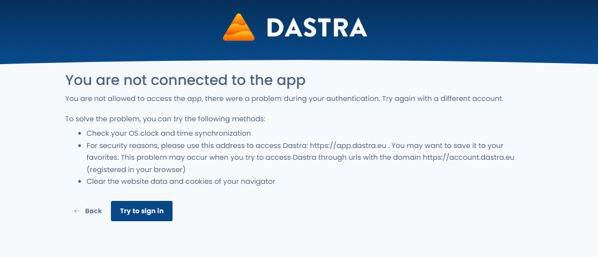

# Known problems

## Resolve problems with your browser's cache

When you use a browser, it uses cache and cookies to store information from websites. Deleting them fixes some problems, such as those related to loading applications like Dastra.

To solve these problems, we provide you with several solutions:

1. **Update your browser**, using CTRL + F5 (or MAC + F5)&#x20;
2. If the first solution does not work, **reset your preferences**. This action will allow you to easily delete cookies set by Dastra, clear items from your local storage, and reset your display preferences in Dastra, and may help resolve some display problems and bugs.

To activate it, go to the "profile" tab in your personal settings:

<figure><figcaption></figcaption></figure>


Selecting this option will cause you to lose your column settings in all Dastra tables and re-trigger the display of tutorials in all modules.


These two actions did not solve your problem? Contact the support directly from the application, via chat or the "megaphone" tab.

##

## 401 error during connection

**Scenario** : you connect to Dastra via the url https://app.dastra.eu, you enter your login and you arrive on an error page "**Access denied (401)**" .&#x20;

Preview of the page:

<figure><figcaption></figcaption></figure>

**Solutions**:&#x20;

1. **Check your computer's clock settings**. It's strongly recommended to activate the time synchronization with the internet. Indeed, the expiration times of your identification tokens are compared to the time of your machine. If the date is not well synchronized with the server time, you will encounter this error. To configure your clock, go to the following links:
   * [Mac](https://support.apple.com/en-ca/guide/mac-help/mchlp2996/mac)
   * [PC](https://support.microsoft.com/en-us/windows/how-to-set-your-time-and-time-zone-dfaa7122-479f-5b98-2a7b-fa0b6e01b261)
2. **Use this address to access Dastra: https://app.dastra.eu** . You can save it to your favorites. This problem may occur when you try to access Dastra through urls with the domain account.dastra.eu (often automatically saved in your browser's url suggestions)
3. **Clean up your browser's site data and cookies**

##

## Error 403: Access Denied

The error message "Error 403: Access Denied" indicates that you are trying to access a part of the Dastra system without the necessary authorization. This occurs when access to certain elements or modules has been restricted by an administrator based on your role or team permissions within your workspace.

**How to Resolve It**

**Check Permissions**: Ensure you have the necessary permissions for the desired module or item.

**Contact a Workspace Administrator**: If in doubt, contact a workspace administrator to verify or update your access rights.

##

## Error 404: Element Not Found

The error message "Error 404: Element Not Found" indicates that you are trying to access an element that cannot be found on Dastra. This may occur if the element has been modified, moved, or deleted (by yourself or another user).

**How to Resolve**

* **Check the URL**
* **Search for the element using a search engine**

##

## Error 500

This error can occur occasionally and is often caused by:

* Connection issues
* Problems related to your environment (browser, extension, etc.)
* Multiple people working simultaneously on the same element
* Executing an action that requires significant server resources

In most cases, this is a temporary issue, and we recommend waiting a few minutes before trying again.

If the problem persists, please report a bug using the megaphone in Dastra so our teams can investigate the issue. 

##

## Error Message: "Label field is required."&#x20;

This message typically appears when a field is left blank while answering a questionnaire.

## Error message : "Prohibited HTML content is present in a field !"

<figure><figcaption>
Prohibited HTML content is present in a field !
</figcaption></figure>

\
This message means that HTML code (usually enclosed in angle brackets `< >`) is present in a field where HTML is not allowed (for security reasons). 

\
The following message makes it easy to identify the affected field:

<figure><figcaption>
Prohibited HTML content is present in a field !
</figcaption></figure>

## Error message: "The user ID does not exist in your organization." when recording a data processing.

This message means that a user who has been removed from your workspace is still set as an Accountable in the stakeholders of the data processing.

The deleted user must be removed from the stakeholders of the data processing to resolve this issue.
